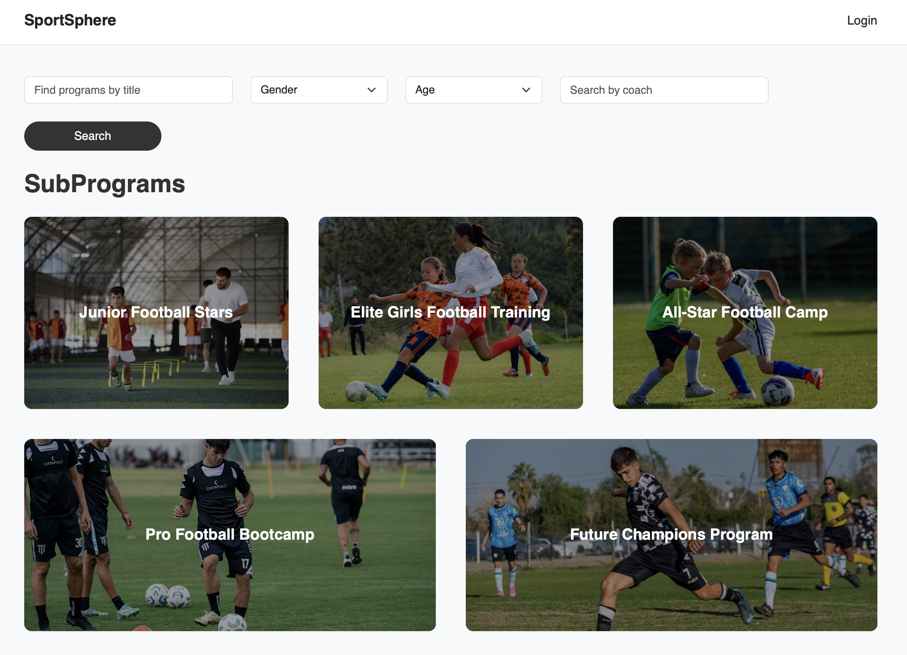
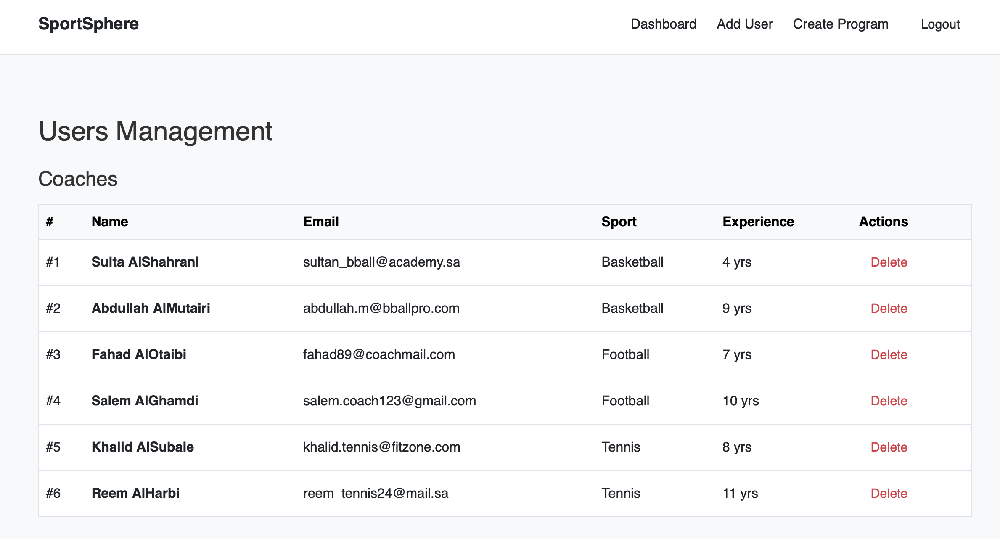

# 🏅 SportSphere – Youth Sports Academy Management System

SportSphere is a simple Django-based system for managing sports programs for kids and teens. It supports multiple user roles and helps parents, coaches, and admins stay organized.

---

## 🔧 Features

### 👨‍👩‍👧‍👦 User Roles
- There are three types of users: Admins, Coaches, and Parents.
- Each role has access to different parts of the system.

### 🧒 Add and Manage Children
- Parents can add their kids to the system.
- They can also edit or remove their children’s profiles.

### 🏆 SubPrograms and Enrollments
- Admins and coaches can create subprograms like “Football 8–10 (Boys)”.
- Parents can enroll their children in available programs that match age and gender.

### 🔍 Filters and Search
- Search and filter tools are available to quickly find subprograms or children by name, age, gender, or coach.

### 💬 Messaging System
- Parents can message their child’s coach from their dashboard.
- Coaches can view and reply to messages from parents.

### 📷 Optional Images
- Coaches, children, and subprograms can have images uploaded.
- The system handles cases where no image is provided.

---

## 📦 Technologies Used

- Django (Python)
- Bootstrap 5 (for styling)
- SQLite (default database)
- HTML & CSS

---

## 💡 Notes

- Admins can create and delete coaches and players.
- Subprograms are organized under programs like Football, Basketball, etc.
- All pages are responsive and mobile-friendly.

---

##  Screenshots

---

---

 
